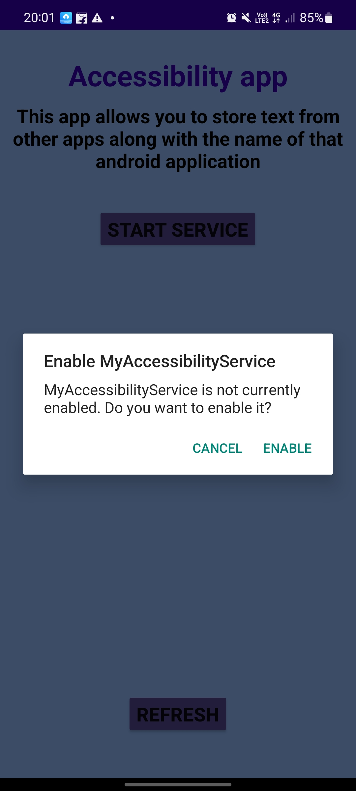

# Accessibility-feature-app
This app copies text from other android application in it.

<h3>Enable Accessibility service</h3>

<h3>Main Page</h3>

<h3>On Strting the service</h3>

<h3>On deleting</h3>

<h3>On Refreshing</h3>

